# Roktakto Prantor

**Roktakto Prantor** is our second game, developed by **Team Thunder Wolves**. Originally released on **March 26th**, in celebration of our **Independence Day**, this game is a **1.2 game project**. We aimed to **virtually portray the University of Rajshahi (partially)**, immersing players in an intense battle to **free the campus from illegal invaders who have set up a base in the 4th Science Building**.

## Features
- 🏛 **Virtual Representation of Rajshahi University**
- 🎮 **Action-Packed FPS Gameplay**
- 🔥 **Mission-Based Progression**
- 💡 **Immersive Graphics & Realistic Environments**
- ⚔ **Engage in Combat to Free the Campus**

## Software Used
- **Unreal Engine** – Game development
- **Blender** – 3D Modeling
- **SketchUp** – Environment design

## Gameplay Preview
🎥 Watch the gameplay trailer here: [YouTube Link](https://www.youtube.com/watch?v=DVO5ypzr3lY)

## Screenshots
<table>
  <tr> Our Main Gate and Administrative Building</tr>
  <tr>
    <td>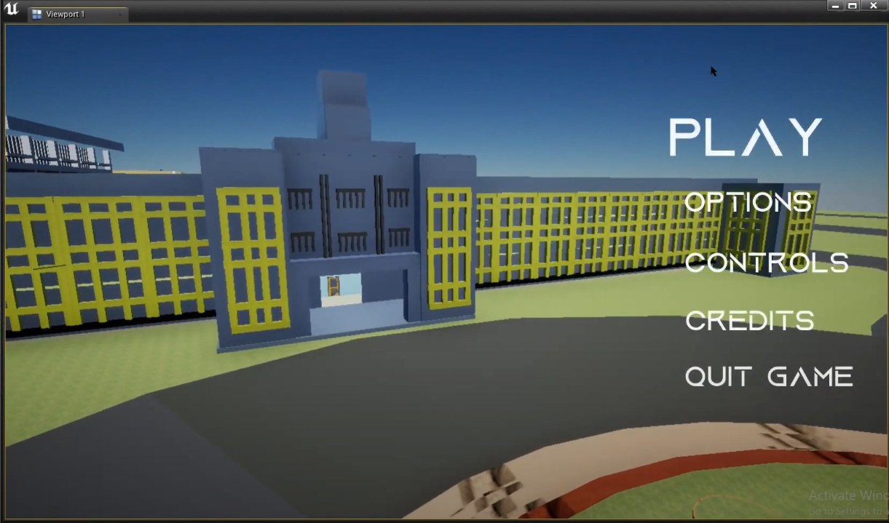</td>
    <td>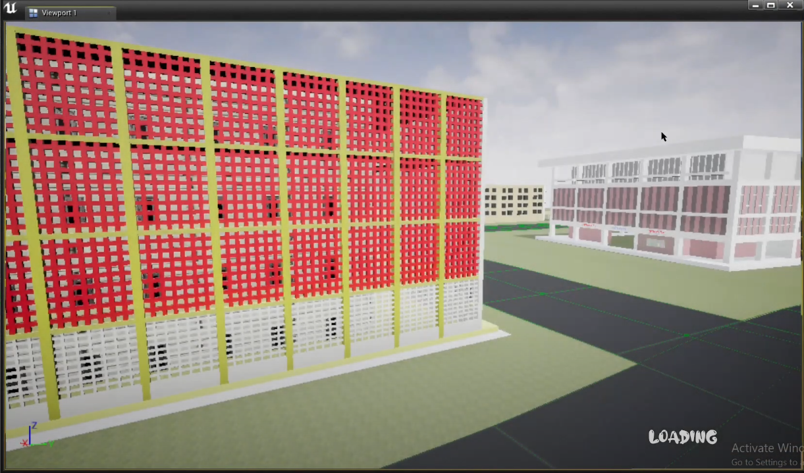</td>
    <td>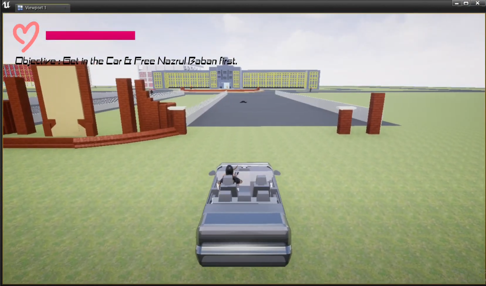</td>
    <td>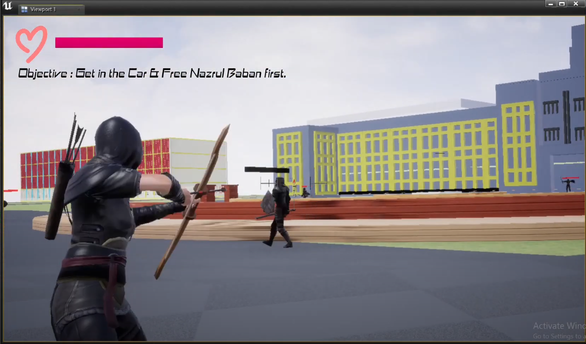</td>
  </tr>
</table>
<table>
  <tr> Inside our Administrative Building and Faculty of Fine Arts Building and Central Mosque</tr>
  <tr>
    <td>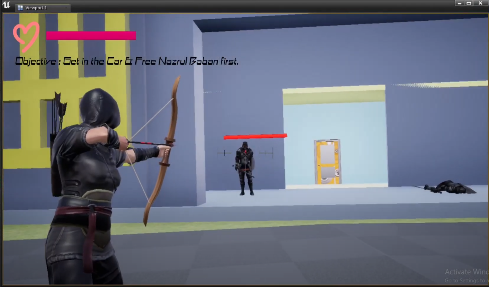</td>
    <td>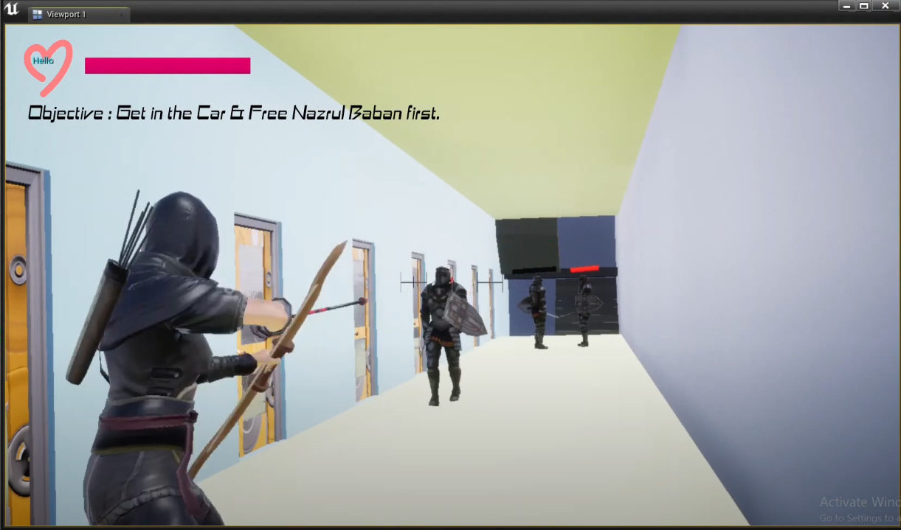</td>
    <td>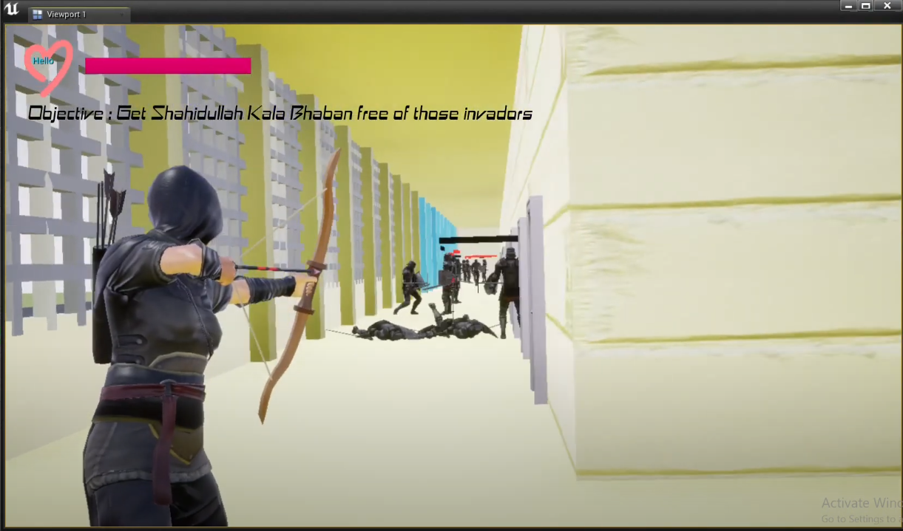</td>
    <td>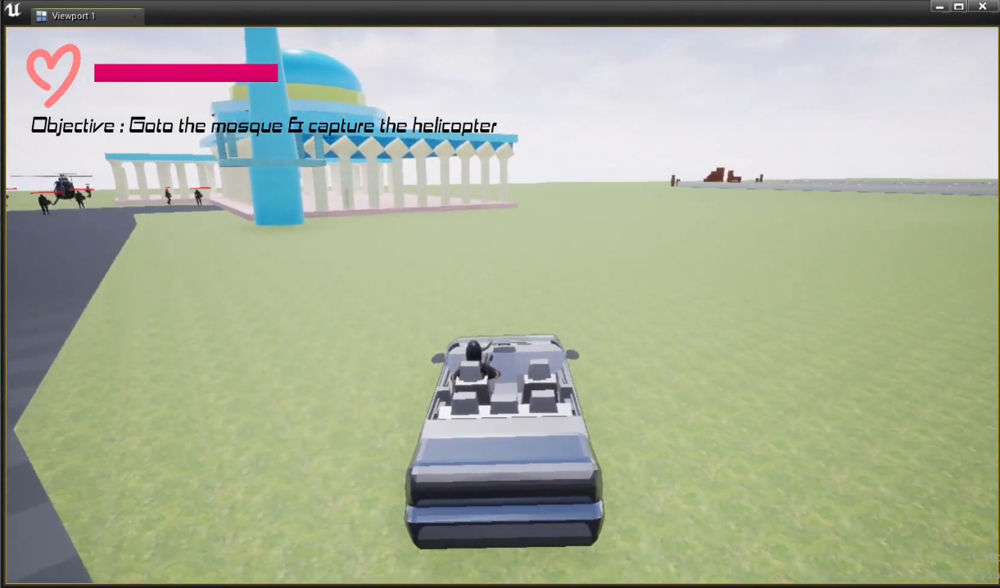</td>
  </tr>
</table>
<table>
  <tr>Fight at the Central Mosque and Helicopter Landing on the Fourth Science Building</tr>
  <tr>
    <td>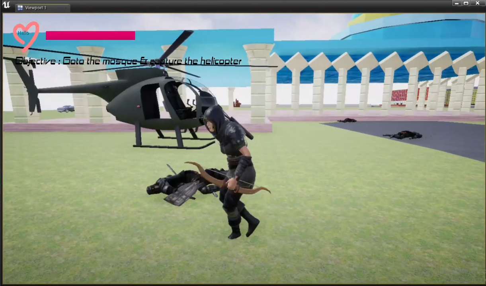</td>
    <td>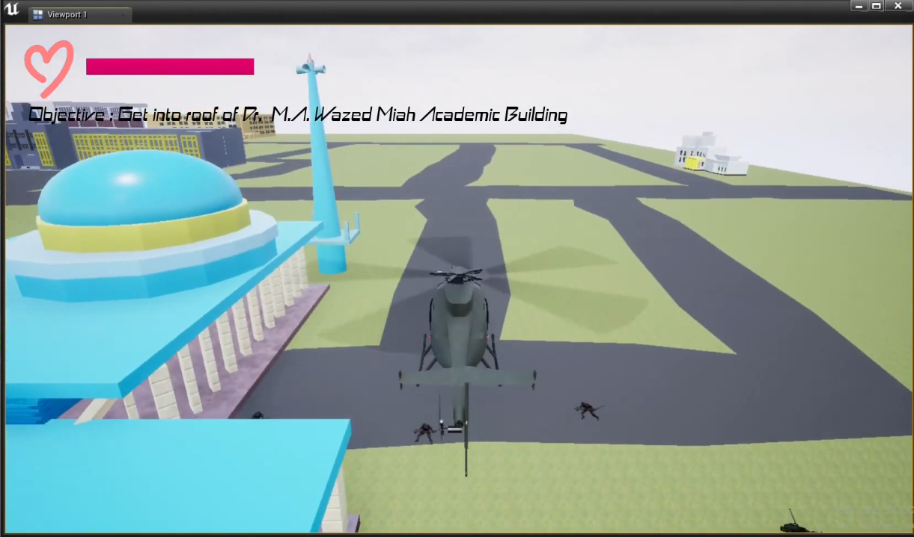</td>
    <td>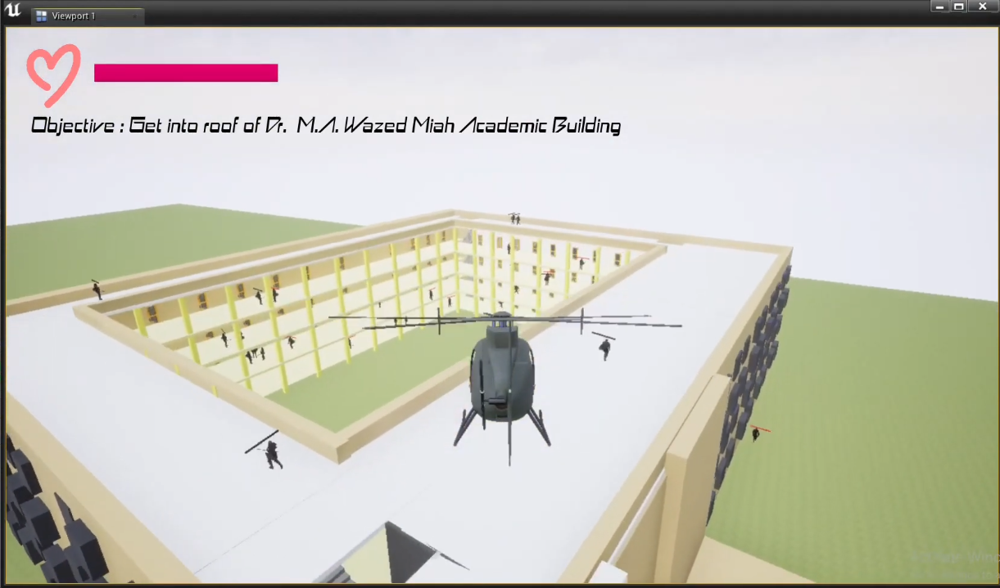</td>
    <td>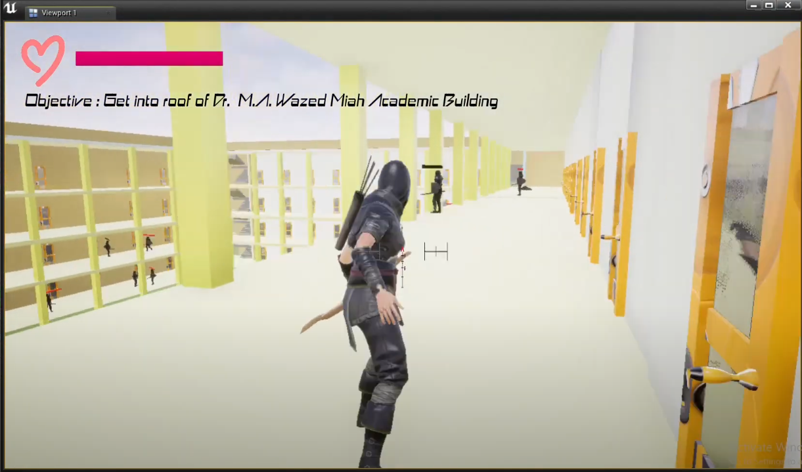</td>
  </tr>
  <tr>Fight at the Fourth Science Building and the Ending</tr>
  <tr>
    <td>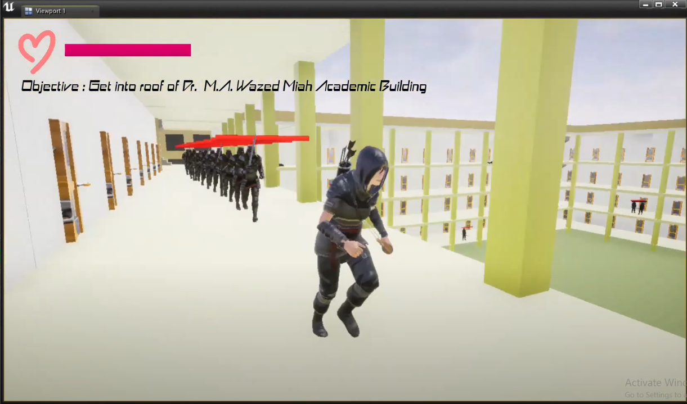</td>
    <td>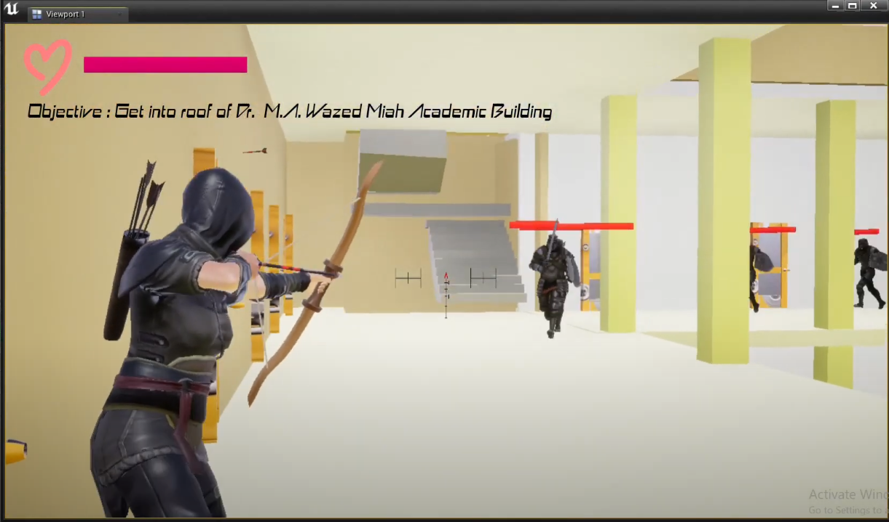</td>
    <td>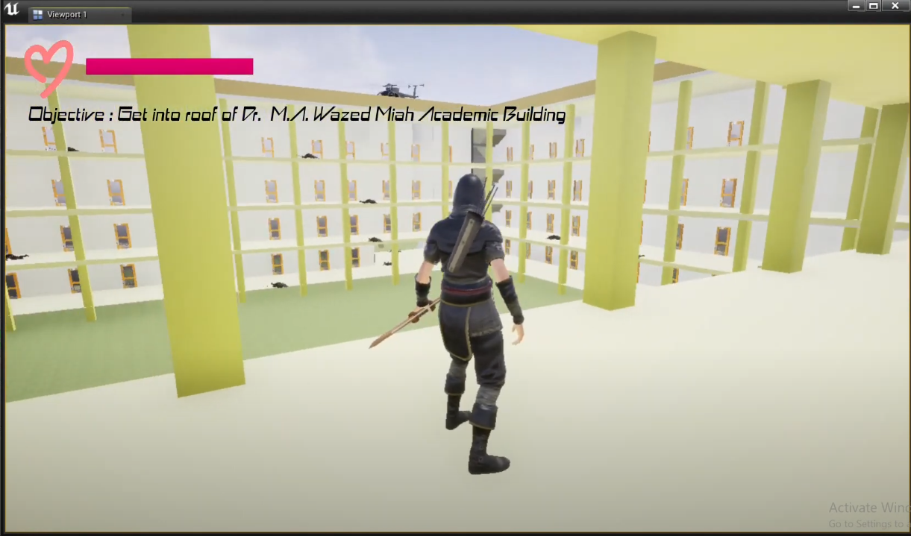</td>
    <td>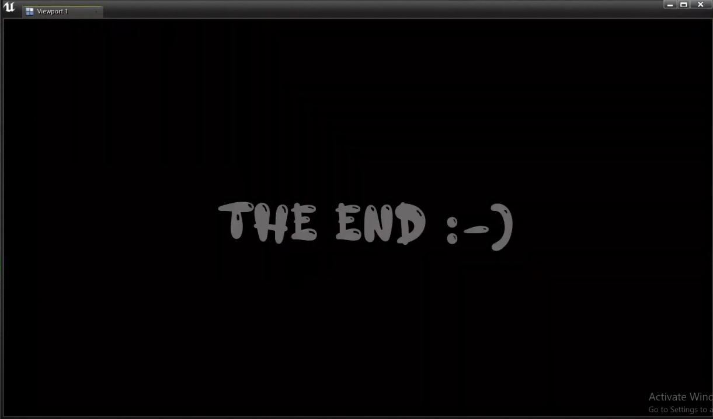</td>
  </tr>
</table>

## Future Plans
- 🚀 **Expand the map** to include more university locations.
- 🧠 **Improve AI Mechanics** for smarter enemy behaviors.
- 🔫 **Add new weapons & abilities** for diverse gameplay.
- 📖 **Introduce a storyline mode** with deeper missions.

## License
This project is developed by **Team Thunder Wolves** and is subject to its respective copyright.

